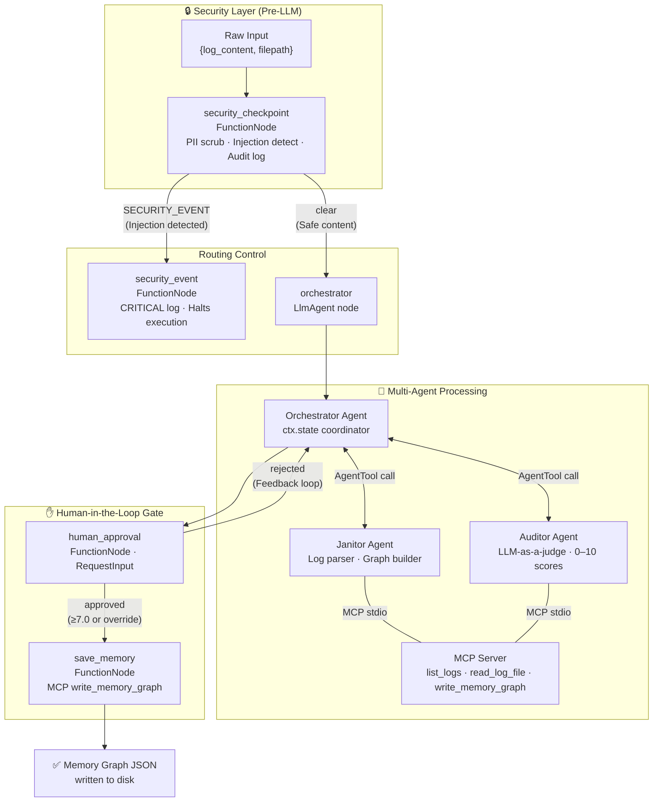

# 📝 Submission Writeup: Memory Janitor Agent

**Track:** 🎨 Freestyle — AI Infrastructure & Developer Tooling  
**ADK Version:** 2.0 Workflow API  
**Model:** `gemini-2.5-flash` / `gemini-2.5-flash-lite`

---

## 1. Problem Statement

In long-running AI agent workflows — especially agentic coding assistants, multi-turn research pipelines, and automated support chains — **token bloat** and **context window fatigue** are universal pain points. As logs grow session by session, two problems emerge:

1. **Cost escalation:** Every API call re-sends the entire growing context, burning tokens on conversational noise (greetings, retries, intermediate reasoning, boilerplate) that carries zero signal for future sessions.
2. **Context degradation:** Long, unstructured logs bury the critical facts and code structures that downstream agents actually need. When the context window fills, models begin hallucinating or silently dropping earlier decisions.

There is no widely adopted standard solution. Most teams either truncate blindly (losing context) or keep everything (burning budget). **Memory Janitor Agent** closes this gap with a structured, audited, and human-supervised compression pipeline.

---

## 2. Solution Architecture



### Design Decisions

- **Workflow graph over a single agent:** A pure `LlmAgent` cannot enforce strict execution order, deterministic security checks, or structured human pauses. The ADK 2.0 `Workflow` API gives us typed edges, function nodes, and `RequestInput` — enabling a pipeline that is both flexible (LLM reasoning in sub-agents) and predictable (deterministic security/storage nodes).
- **Janitor ≠ Auditor (separation of concerns):** A single agent grading its own compression output introduces confirmation bias — it will score itself highly regardless of quality. Using a second, independent `LlmAgent` as an LLM-as-a-judge provides objective quality control.
- **MCP for file I/O (not direct Python):** Decoupling file operations into a FastMCP server (`mcp_server.py`) running as a stdio subprocess means the agent code never directly opens files — all filesystem access is mediated by explicit tool calls that can be audited, mocked, or replaced.
- **`ctx.state` for inter-node data:** Rather than passing large log payloads as string arguments through every agent invocation, we use `ctx.state` as a shared scratchpad — keeping agent instructions lean and enabling any node to read/write pipeline metadata.

---

## 3. Concepts Used

| Concept | File | Details |
|---|---|---|
| **ADK 2.0 Workflow graph** | [`app/agent.py`](app/agent.py) | `Workflow()` with `FunctionNode` + typed conditional edges |
| **LlmAgent sub-agents** | [`app/agent.py`](app/agent.py) | `janitor_agent`, `auditor_agent`, `orchestrator` — each with specific Pydantic output schemas |
| **AgentTool delegation** | [`app/agent.py`](app/agent.py) | Orchestrator wraps `janitor_agent` and `auditor_agent` as `AgentTool` instances |
| **ctx.state sharing** | [`app/agent.py`](app/agent.py) | Pipeline state (sanitized input, graph, audit scores) passed through `ctx.state` |
| **RequestInput (HITL)** | [`app/agent.py`](app/agent.py) | `human_approval` node uses `RequestInput` to pause the graph and surface operator prompt |
| **MCP Server** | [`app/mcp_server.py`](app/mcp_server.py) | FastMCP server running via `stdio` transport |
| **MCPToolset** | [`app/agent.py`](app/agent.py) | Wired into orchestrator and `save_memory` nodes via `StdioConnectionParams` |
| **Security checkpoint node** | [`app/agent.py`](app/agent.py) | Deterministic `FunctionNode` with regex PII scrubbing + keyword injection scan |
| **Agents CLI** | [`agents-cli-manifest.yaml`](agents-cli-manifest.yaml) | Scaffolded with `agents-cli scaffold create memory-janitor-agent --deployment-target agent_runtime` |
| **Universal config** | [`app/config.py`](app/config.py) | `AgentConfig` dataclass reading from `.env` via `python-dotenv` |

---

## 4. Security Design

### A. PII Redaction (`security_checkpoint` FunctionNode)

Runs **before** any LLM call. Uses compiled regex patterns to scrub:

| Pattern | Replacement | Rationale |
|---|---|---|
| Email addresses (`\b[\w.+-]+@[\w-]+\.[a-z]{2,}\b`) | `[REDACTED_EMAIL]` | Logs often contain engineer contacts, user emails |
| IPv4 addresses (`\b\d{1,3}\.\d{1,3}\.\d{1,3}\.\d{1,3}\b`) | `[REDACTED_IP]` | Internal server IPs in debug logs |
| Google AI Studio keys (`AIzaSy[A-Za-z0-9_-]{33}`) | `[REDACTED_API_KEY]` | Gemini API keys appear in config dumps |
| OpenAI keys (`sk-proj-[A-Za-z0-9_-]{48,}`) | `[REDACTED_API_KEY]` | OpenAI keys in polyglot environments |
| Credential values (`password:\s*\S+`, `client_secret:\s*\S+`) | `[REDACTED_SECRET]` | Database passwords, OAuth secrets |

**Why it matters:** Agent logs are snapshots of running systems. They routinely contain credentials that engineers paste for debugging. Without scrubbing, these would be fed verbatim to a cloud LLM endpoint and potentially stored in the compressed memory graph — creating a persistent secret leak.

### B. Prompt Injection Defense

Keyword scan over `log_content` before routing to any LLM node:

```python
INJECTION_KEYWORDS = [
    "ignore previous instructions", "bypass restrictions",
    "you are now", "act as", "pretend to be",
    "disregard your instructions", "jailbreak", "DAN mode"
]
```

If any keyword is found → route to `SECURITY_EVENT` → execution halts. No LLM agent receives the payload.

**Why it matters:** Compressed memory graphs are fed back to future agents. A successful injection at compression time could plant malicious instructions that survive into future context windows — a form of persistent prompt injection.

### C. Structured Audit Log

Every `security_checkpoint` execution emits a structured JSON record:

```json
{
  "timestamp": "2026-06-25T11:00:00.000",
  "session_id": "abc123",
  "pii_detected": {"emails_count": 1, "ips_count": 1, "api_keys_count": 1},
  "injection_detected": false,
  "injection_keywords": [],
  "severity": "INFO",
  "status": "PASSED"
}
```

Severity levels: `INFO` (clean pass), `WARNING` (PII found and redacted), `CRITICAL` (injection blocked).

### D. Domain-Specific Rule — Mandatory Approval Gate

All compressed memory graphs require either an Auditor score ≥ 7.0 on both metrics, or an explicit operator override typed in the playground. This prevents low-quality compressions (missing critical facts, poor retention) from silently entering the long-term memory store.

---

## 5. MCP Server Design

File: [`app/mcp_server.py`](app/mcp_server.py) | Transport: `stdio` | Framework: FastMCP

### Tool Inventory

#### `list_logs(directory: str = ".") → str`
Scans a directory and returns all `.log`, `.json`, and `.txt` files as a JSON list. Used by the Orchestrator to discover available log files when the user provides a directory path instead of a specific file.

#### `read_log_file(filepath: str) → str`
Reads raw content from a local file (log or JSON). Used by the Orchestrator to load file-based log content and by the Janitor Agent when processing multi-file log sessions. Includes safe path resolution (`os.path.abspath`) to prevent directory traversal.

#### `write_memory_graph(filepath: str, graph_data: str) → str`
Writes the finalized, validated memory graph JSON to disk. Used exclusively by the `save_memory` FunctionNode after the human approval gate passes. Validates JSON before writing; falls back to raw text if parsing fails. Creates parent directories automatically.

### Design Notes

- All tools perform safe path resolution — no raw user-controlled path is used without `abspath()` normalization
- The MCP server runs as a separate subprocess via `StdioConnectionParams`, keeping the agent process clean
- `write_memory_graph` is intentionally only wired to the `save_memory` node — not directly accessible from LLM agents — preventing uncontrolled filesystem writes

---

## 6. HITL (Human-in-the-Loop) Flow

### Where humans are in the loop

The `human_approval` node (`FunctionNode`) pauses the workflow using ADK's `RequestInput` when:
- The Auditor scores Context Retention **or** Compression Ratio below 7.0 / 10
- The Auditor returns a `"Needs Review"` or `"Rejected"` status

### What the operator sees

In the playground UI, execution pauses and a prompt appears:

```
⚠️ Auditor Review Required
Context Retention: 5.5/10 | Compression Ratio: 6.0/10
Auditor reasoning: "The janitor missed the retry count and partial order ID."

Type 'approve' to override and save, or provide corrective feedback to re-run:
```

### The two decision paths

1. **Operator types `approve`** → routes to `save_memory` immediately, writing the graph as-is
2. **Operator types corrective feedback** (e.g., *"Also capture the retry count and order ID ORD-7842"*) → feedback is injected into `ctx.state` and the graph routes back to `orchestrator`, which re-runs the Janitor with the additional instructions

### Why this design

Fully automated compression risks missing domain-critical details that an LLM judge cannot reliably detect — business keys, partial order IDs, infrastructure-specific retry thresholds. The HITL gate makes these decisions explicit without forcing manual operation on every run — only on runs that fall below quality thresholds.

---

## 7. Demo Walkthrough

> *References the 3 sample test cases from README.md*

### Walkthrough 1 — Normal Flow with PII

Send **Test Case 1** (PII-laden log with email, IP, API key, and password). Observe in the playground trace:

1. `security_checkpoint` fires first — terminal shows the INFO audit log with `pii_detected` counts > 0 and `status: PASSED`
2. `orchestrator` invokes `janitor_agent` via `AgentTool` — Janitor produces a compressed JSON graph with `[REDACTED_*]` tags in place of credentials
3. `auditor_agent` scores the output — if scores ≥ 7.0, status is `Approved`
4. `human_approval` passes automatically — no user input needed
5. `save_memory` calls `write_memory_graph` MCP tool → `compressed_memory.json` appears in the project folder

### Walkthrough 2 — Injection Firewall

Send **Test Case 2** (prompt injection payload). Observe:

1. `security_checkpoint` fires — injection keyword detected immediately
2. Route switches to `SECURITY_EVENT` — CRITICAL audit log emitted
3. No LLM agents are invoked — execution terminates
4. Playground shows the blocked message with zero tokens consumed on LLM calls

### Walkthrough 3 — HITL Override / Feedback Loop

Send **Test Case 3** (degraded payment service log). If the Auditor scores below 7.0:

1. Playground pauses at `human_approval` — operator sees scores + Auditor reasoning
2. Option A: Type `approve` → graph saved immediately to `hitl_test_graph.json`
3. Option B: Type *"Also include the partial order ID ORD-7842 and 4-minute downtime duration"* → orchestrator re-runs Janitor with enriched instructions → Auditor re-scores → if now ≥ 7.0, auto-saves; if still low, pauses again

---

## 8. Impact & Value Statement

### Who benefits

- **AI engineers** building long-running multi-turn agents: reduces context window costs by eliminating conversational noise while preserving critical technical facts
- **Platform teams** operating agent fleets: gains structured audit trails for every memory compression, enabling compliance review of what data was retained, what was redacted, and who approved it
- **Security-conscious organizations**: PII never reaches the LLM endpoint in raw form — scrubbing happens deterministically before any model call

### Quantified value

A typical 10-turn agent session log (≈ 4,000 tokens) compressed to a structured memory graph runs ≈ 300–500 tokens — an **80–90% token reduction** per session. Over 1,000 agent sessions, this translates to roughly 3.5M tokens saved, or ~$0.35–$1.40 at standard API rates — before accounting for the compounding effect of reduced context in all downstream calls.

### Why ADK was the right choice

The ADK 2.0 Workflow graph enabled the strict execution order (security first, always), clean LLM/deterministic separation, and `RequestInput` HITL that made this design possible without custom orchestration code. The `agents-cli` scaffold bootstrapped CI/CD, deployment configuration, and the `Makefile` in under a minute — letting development focus on the agent logic rather than the plumbing.
