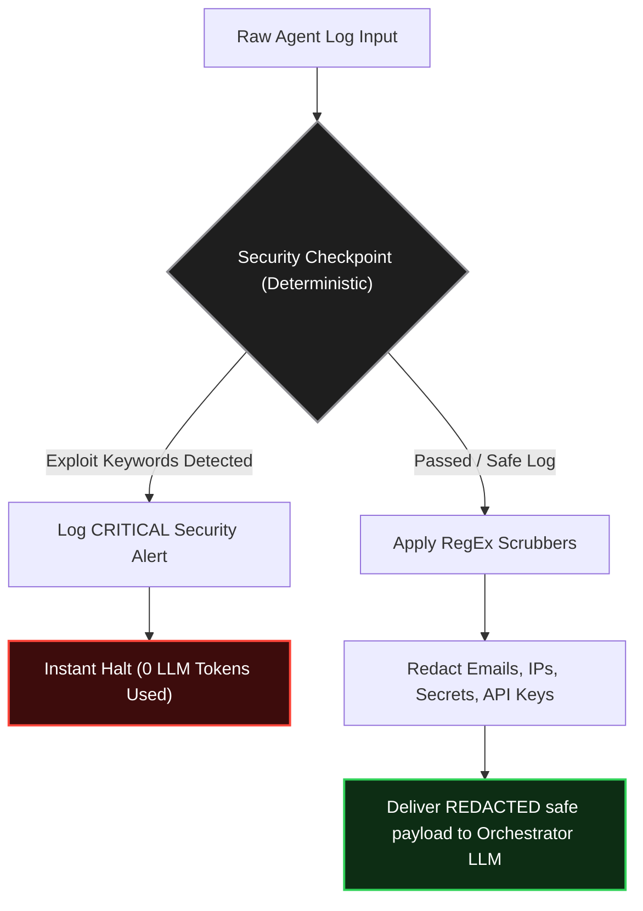
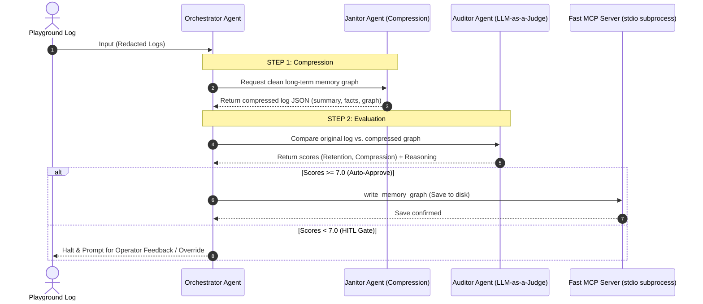

# Memory Janitor Agent: Video Storyboard & Visual Assets Guide (Premium Edition)

This guide details the generated visual assets (Apple Keynote/macOS style), their matching narration segments, and custom Mermaid diagrams designed to serve as high-impact overlays or slides during the product presentation video.

---

## 1. Apple-Style Presentation Visuals

These visual assets are built with Apple’s design philosophy: premium dark glassmorphic panels, soft ambient backlights, clean macOS-style windows, and sleek San Francisco typography.

### Section A: Core Architecture & Cost
````carousel

<!-- slide -->

<!-- slide -->

<!-- slide -->

````

### Section B: Test Case Walkthroughs
````carousel

<!-- slide -->

<!-- slide -->

````

---

## 2. Storyboard & Placement Timeline

Here is how the narration script maps directly to the visual assets and Mermaid diagrams:

| Time | Narration (Script Segment) | Visual Placement / Overlay |
| :--- | :--- | :--- |
| **0:00 - 0:20** | *"Every AI agent workflow has a silent cost hiding in plain sight. As your agent execution logs grow, you end up sending thousands of tokens of pure noise... back to the model..."* | **Asset A2: Token Reduction Slide** ([Result/apple_silent_cost.png](Result/apple_silent_cost.png)) showing the high-signal compression and 85% token savings. |
| **0:20 - 0:50** | *"At its core, the Memory Janitor Agent is a multi-agent pipeline. It takes raw, verbose chat logs... scrubs credentials, compresses them... and saves it to disk."* | **Asset A1: Workflow Infographic** ([Result/apple_pipeline_overview.png](Result/apple_pipeline_overview.png)) depicting the pipeline nodes as clean frosted glass cards. |
| **0:50 - 1:20** | *"Every input goes through the security checkpoint node first... runs optimized regex patterns to redact emails, IPs, API keys... scans for injection keywords."* | **Diagram A: Security Checkpoint Guard** (Scroll down to see the Mermaid diagram) showing the block and redaction forks. |
| **1:20 - 1:40** | *"Let’s look at our first test case: the automated PII redaction workflow. I’ll submit a raw log containing an unredacted email, a local backup IP, a plaintext database password, and a live Google API key..."* | **Asset B1: Case 1 - PII Redaction Demonstration** ([Result/case1_pii_redaction.png](Result/case1_pii_redaction.png)) showing raw vs redacted JSON windows side-by-side. |
| **1:40 - 2:00** | *"Now let’s test our second scenario: an active prompt injection attack. As you can see, the security checkpoint catches the exploit keywords immediately..."* | **Asset B2: Case 2 - Prompt Injection Firewall** ([Result/case2_injection_blocked.png](Result/case2_injection_blocked.png)) showing the warning alert, blocked logs, and 0 tokens stat. |
| **2:00 - 2:40** | *"When an ambiguous log causes the Auditor to return scores below our seven point zero threshold, the playground halts execution and surfaces a Request Input prompt..."* | **Asset B3: Case 3 - HITL Interface Loop** ([Result/case3_hitl_interaction.png](Result/case3_hitl_interaction.png)) showing the macOS dialogue card capturing operator's `"approve"` text cursor. |
| **2:40 - 3:15** | *"By turning a thousand-token session log into a structured, three-hundred-token memory graph, this pipeline achieves an immediate eighty to ninety percent reduction... Engineers get lower costs, security teams get audit trails..."* | **Asset A4: Conclusion Summary Slide** ([Result/apple_conclusion_summary.png](Result/apple_conclusion_summary.png)) summarizing Secure, Automated, and Intelligent value pillars. |

---

## 3. High-Impact Mermaid Diagrams

These diagrams can be rendered dynamically or added as slides:

### Diagram A: Security Checkpoint Guard
This visualizes the deterministic security layer before logs hit any LLMs.



### Diagram B: Multi-Agent & Model Context Protocol (MCP) Workflow
This visualizes the Orchestration pipeline and the decoupling of the File System via MCP Server.


